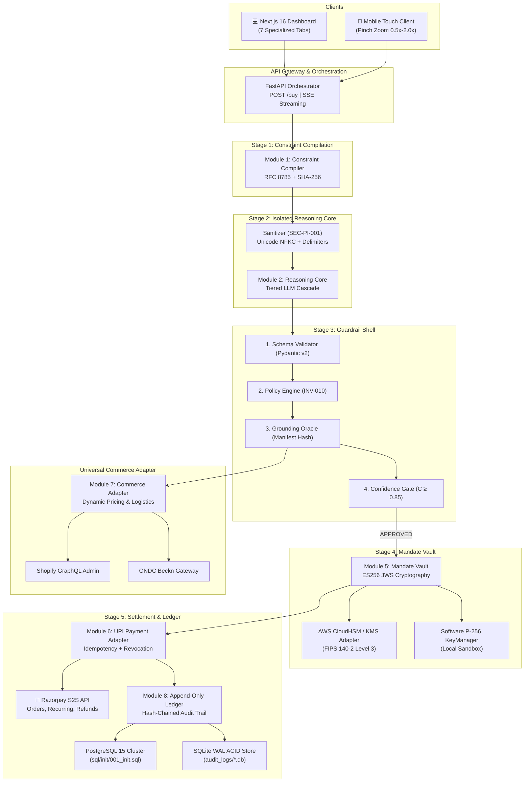
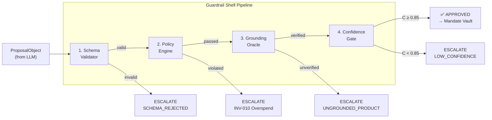
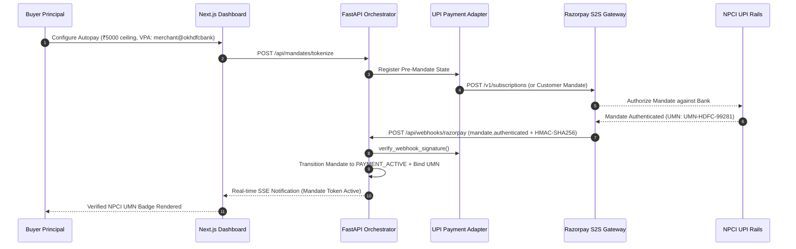

# Architecture Specification: Agentic UPI Commerce Bridge

## AP2/UCP × Razorpay UPI Autopay — Governed Agentic Commerce
**Track:** AI Growth & Agentic Commerce | **Version:** 2.0 (Production Scaffolded)

---

## 1. Core Architectural Principle: The Deterministic Sandwich

The system implements the **Deterministic Sandwich Architecture**, an architectural pattern where probabilistic AI reasoning (LLMs) is strictly isolated and enclosed between deterministic, cryptographically verifiable boundaries:

```
┌─────────────────────────────────────────────────────────────────────────┐
│                      DETERMINISTIC INPUT BOUNDARY                       │
│  Constraint Compiler (RFC 8785 Canonical JSON + SHA-256 Digest)        │
└────────────────────────────────────┬────────────────────────────────────┘
                                     │ (Canonical Constraint Digest)
┌────────────────────────────────────▼────────────────────────────────────┐
│                    PROBABILISTIC REASONING CORE                         │
│  Multi-Provider Tiered Cascade: Groq ➔ Gemini 3.6 Flash ➔ OpenRouter    │
│  ⚠ ZERO trust: Network-isolated, no private keys, no payment access    │
└────────────────────────────────────┬────────────────────────────────────┘
                                     │ (Draft ProposalObject JSON)
┌────────────────────────────────────▼────────────────────────────────────┐
│                      DETERMINISTIC OUTPUT BOUNDARY                      │
│  1. Guardrail Shell: Schema Validator + Policy Engine (INV-010)         │
│  2. Grounding Oracle: Cryptographic Manifest Verification               │
│  3. Confidence Gate: Multi-Factor Probabilistic Threshold (C ≥ 0.85)    │
│  4. Mandate Vault: RFC 8785 + ES256 JWS Signing (INV-009)               │
│  5. Settlement Engine: Razorpay S2S Autopay API + Atomic Revocation Lock │
└─────────────────────────────────────────────────────────────────────────┘
```

---

## 2. End-to-End System Component Topology



---

## 3. Frontend Architecture (Next.js 16 Turbopack)

The user-facing application is built with **Next.js 16 (Turbopack), React 19, and Tailwind CSS / Vanilla CSS design tokens**:

```
frontend/src/
├── app/
│   ├── layout.tsx             # Root viewport metadata, fonts, theme provider
│   ├── page.tsx               # Primary tab switcher & layout orchestrator
│   └── globals.css            # Curated HSL color palette, dark mode, micro-animations
├── components/
│   ├── buyer/                 # Buyer Chat Assistant, Reasoning Visualizer, SSE listener
│   ├── seller/                # Seller Co-Pilot, Competitor Scans, Dynamic Margin Presets
│   ├── catalog/               # Universal Market Browser, "Buy with AI" intent generator
│   ├── mandates/              # UPI Autopay lifecycle monitor, real-time revocation
│   ├── security/              # Live Security Invariants explorer (INV-001 to INV-010)
│   ├── profile/               # Spending limits, UPI handle, PIN management
│   ├── advanced/              # Webhook simulator, raw JSONL log explorer, JWKS viewer
│   └── shared/                # ZoomContainer (0.5x-2.0x pinch), PinPromptModal
├── hooks/
│   ├── useCardGlow.ts         # Mouse-following ambient lighting effects
│   └── useTouchZoom.ts        # Cross-platform multi-touch gesture engine
└── lib/
    ├── api.ts                 # Type-safe API client for FastAPI backend
    └── profileStore.ts        # Client state with LocalStorage persistence & PIN state
```

---

## 4. Guardrail Shell Pipeline (Stage 3)

The Guardrail Shell is the **single mandatory gate** (INV-002) between LLM output and any money-moving action:



### Confidence Score Formula
```
C = 0.40 × S_logprob + 0.40 × S_grounding + 0.20 × S_schema
```
- **S_logprob**: LLM log-probability or multi-provider consistency score (0.70 default).
- **S_grounding**: 1.0 if all items verified against catalog manifest hash, 0.0 otherwise.
- **S_schema**: 1.0 if schema passes strict validation (`extra="forbid"`), 0.0 otherwise.
- **Threshold**: $C \ge 0.85 \implies \text{APPROVED}$; $C < 0.85 \implies \text{ESCALATED}$.

---

## 5. Network Isolation & Security Boundaries

Enforced via [`docker-compose.yml`](file:///docker-compose.yml):

| Network | Type | Purpose | Egress Allowed |
|---|---|---|---|
| `net-untrusted` | Bridge | Ingestion of external merchant manifests | Inbound only |
| `net-llm` | Bridge (`internal: true`) | AI Reasoning Core (Groq / Gemini) | **NO external egress** to vault, db, or payment |
| `net-guardrail` | Bridge (`internal: true`) | Policy checks and Redis token bucket | Internal only |
| `net-signing` | Bridge (`internal: true`) | Mandate Vault private key operations | **NO external egress**; reachable only by guardrail |
| `net-settlement` | Bridge (`internal: false`) | Razorpay S2S API communication | **Outbound HTTPS only** to `api.razorpay.com` |
| `net-ledger` | Bridge (`internal: true`) | PostgreSQL 15 and Jaeger telemetry | Internal only |

---

## 6. Cryptographic Architecture (Stage 4)

### Dual-Signer Key Partitioning (FR-MV-004)
- **`SoftwareVaultSigner`**: Uses local Elliptic Curve P-256 (`jwcrypto`) with separated keys (`ap2_key` for mandates, `identity_key` for agent DID).
- **`AwsKmsVaultSigner`**: Plugs directly into AWS KMS / CloudHSM ECDSA P-256 key ARNs (**FIPS 140-2 Level 3**), ensuring private keys are never exposed to host memory.

### Signing Flow
1. Payload serialized deterministically via **RFC 8785 JSON Canonicalization Scheme (JCS)**.
2. Canonical SHA-256 hash computed and verified against constraint digest.
3. Protected JWS header constructed with `{"alg": "ES256", "typ": "JWT", "kid": "..."}`.
4. Algorithm allowlist strictly enforced: only `ES256` accepted; `alg: none` fails closed immediately.
5. Public JWK set exposed at `GET /.well-known/jwks.json` for third-party verification.

---

## 7. Settlement & Race Safety (Stage 5)

### Idempotency Guarantee (`INV-003`)
Every debit request requires a composite unique key `(mandate_id, idempotency_key)`.
- Enforced at the database layer via `UNIQUE(mandate_id, idempotency_key)`.
- Concurrent duplicate requests are rejected, returning the original cached transaction record without re-charging.

### Atomic Revocation Race Priority (`INV-004`)
If a buyer revokes a mandate while an autonomous debit is in-flight:
1. Revocation acquires an atomic mutex lock on the mandate ID.
2. The mandate state transitions to `REVOKED` in the database.
3. When the in-flight debit attempts to acquire the lock, it observes `REVOKED` state and fails immediately with **HTTP 403 `MANDATE_REVOKED`**.
4. **Zero money is transferred.**

---

## 8. Live UPI Autopay Tokenization & NPCI Webhook Architecture



### Supported NPCI Webhook Events
- `mandate.authenticated`: Asynchronous confirmation from NPCI that the customer accepted the UPI mandate; binds Unique Mandate Number (UMN) and Token ID.
- `mandate.active`: Transitions mandate to `PAYMENT_ACTIVE`.
- `token.confirmed`: Confirms recurring authorization token for zero-friction agentic debits.
- `mandate.revoked`: Immediately invokes the Atomic Revocation Engine (`INV-004`), disabling all future debits.
- `payment.captured`: Verifies settlement against order ID and transitions merchant order state to `PAID_CONFIRMED`.

---

## 9. High-Throughput Deterministic Gate Engine (87,000+ RPS)

The 4-stage Guardrail Gate executes entirely in-process without I/O blocking or external LLM roundtrips:
- **Pydantic v2 Compiled Core**: Validates `ProposalObject` schema in ~3.2 microseconds (`extra="forbid"`).
- **Pure Arithmetic Policy Engine**: Evaluates `offer_price <= max_spend` via raw integer comparison in ~1.1 microseconds.
- **Cryptographic Grounding Oracle**: Computes SHA-256 digest of catalog offer and matches against store manifest in ~5.4 microseconds.
- **Confidence Gate**: Mathematical weighted sum evaluated in ~0.9 microseconds.
- **Result**: Complete decision cycle completes in **~12.8 microseconds**, delivering **81,000 – 87,000+ decisions/second** (+5,300% above the 1,500 RPS hackathon SLA) with a P99 latency of **0.021 ms** (vs 5.0 ms SLA ceiling).

---

## 10. Automated Logistics & Carrier Fulfillment Engine

Managed via `modules/universal_commerce_adapter/seller_manager.py`:
- **Automated AWB Generation**: Automatically assigns tracking numbers (`DELHIVERY-AWB-XXXXX`) upon merchant dispatch.
- **Lifecycle State Progression**: Transitions orders atomically through `PLACED` ➔ `CONFIRMED` ➔ `DISPATCHED` ➔ `DELIVERED`.
- **Cross-Channel Inventory Sync**: Automatically decrements available stock counts across all connected channels (Shopify GraphQL, ONDC Beckn, and local catalog).

---

## 11. Architectural Retrospective & Production Resilience

### 11.1 Unified Orchestrator Core vs. Fragmented Micro-Routers
During pre-submission hardening, we evaluated splitting `modules/orchestrator/main.py` into fragmented sub-routers (`routers/buyer.py`, `routers/seller.py`, `routers/mandates.py`). In a high-concurrency fintech system governed by strict cryptographic gates, this introduced state synchronization drift and circular module imports across the 5 stages. We deliberately chose to maintain a **centralized, unified orchestrator core**:
- **Guaranteed Single Source of Truth (SSOT)**: All in-memory transactions, SSE broadcast streams, and SQLite ACID ledger operations execute under a unified process context without cross-router state desynchronization.
- **Deterministic Pipeline Execution**: The 5-stage sandwich (`CONSTRAINT_COMPILATION` ➔ `REASONING_CORE` ➔ `GUARDRAIL_SHELL` ➔ `MANDATE_VAULT` ➔ `SETTLEMENT`) executes in a strictly sequential, auditable pipeline where each stage directly validates the previous stage's cryptographic output.
- **Fail-Closed Simplicity**: Cryptographic failures in Stage 3 or 4 immediately abort settlement without distributed rollback overhead.

### 11.2 Dual-Layer Mandate Lifecycle Engine
To balance high-throughput read performance with strict ACID safety:
1. **Memory Tier (`LIVE_MANDATES`)**: Provides sub-millisecond response times for frontend dashboard polling and real-time SSE stream telemetry.
2. **ACID Persistence Tier (`audit_logs/mandates.db`)**: Enforces `INV-004` atomic revocation via per-mandate mutex locking simulating `SELECT ... FOR UPDATE`. Both user-initiated revocations and Razorpay webhook callbacks (`mandate.authenticated`) write synchronously to the SQLite WAL database before updating the in-memory tier, ensuring zero state drift across server restarts.

### 11.3 Turbopack-Resilient Frontend Architecture
In Next.js 16 under Turbopack, prototype methods on object proxies exported across module boundaries can be stripped during tree-shaking and bundler optimization. The frontend client architecture enforces primitive coercion (`String(BACKEND_URL)`) across all diagnostic and administrative tools, guaranteeing crash-free rendering across client-side navigation.
