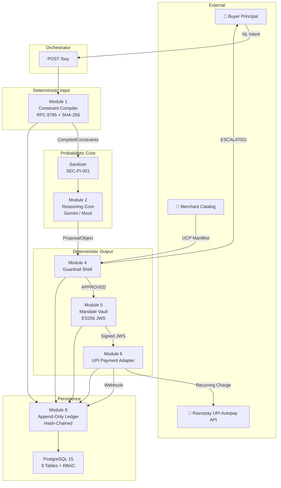
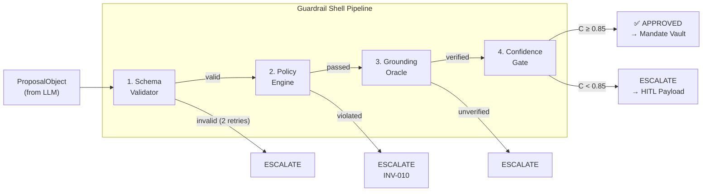
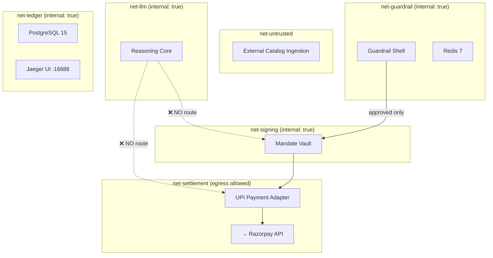
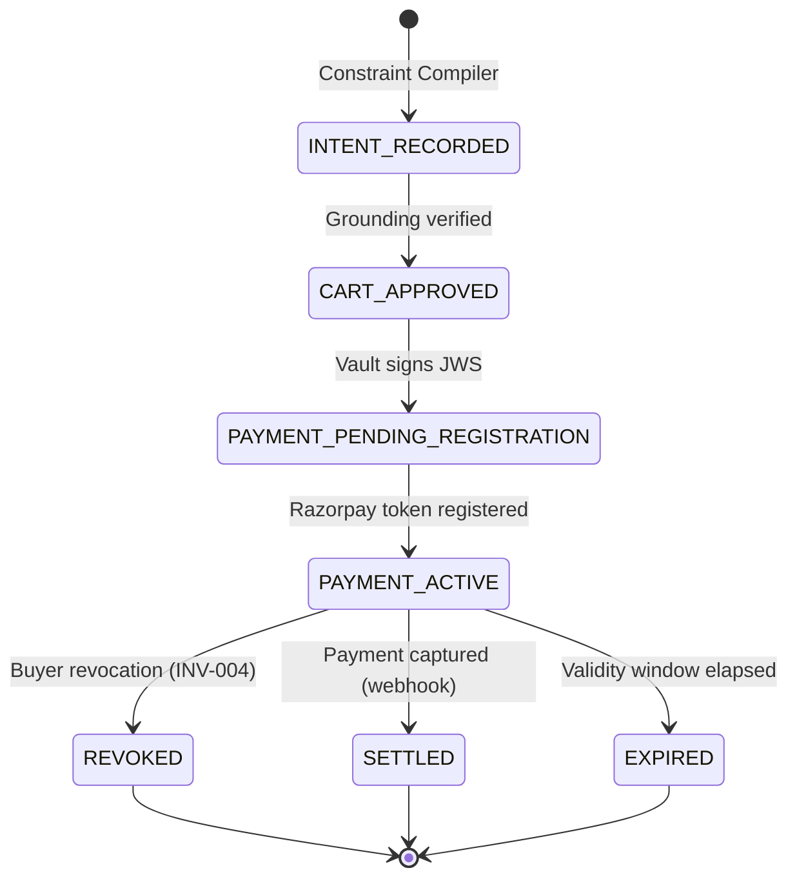

# Architecture Document

## Agentic UPI Commerce Bridge — AP2/UCP × Razorpay UPI Autopay

### Version: 1.0 (Thread 0 — Steel Demo)
### Track: AI Growth & Agentic Commerce

---

## 1. Core Design Principle: Deterministic Sandwich

The system follows a **Deterministic Sandwich Architecture** where probabilistic AI components (the LLM reasoning core) are sandwiched between deterministic, cryptographically verifiable layers:

```
   ┌─────────────────────────────────────────────┐
   │         DETERMINISTIC INPUT LAYER            │
   │  Constraint Compiler (RFC 8785 + SHA-256)    │
   └──────────────────┬──────────────────────────┘
                      │
   ┌──────────────────▼──────────────────────────┐
   │         PROBABILISTIC CORE                   │
   │  LLM Reasoning (Gemini / Mock)               │
   │  ⚠ ZERO trust — treated as adversarial       │
   └──────────────────┬──────────────────────────┘
                      │
   ┌──────────────────▼──────────────────────────┐
   │         DETERMINISTIC OUTPUT LAYER           │
   │  Guardrail Shell → Mandate Vault → Adapter   │
   │  Pure code enforcement, no LLM authority      │
   └─────────────────────────────────────────────┘
```

---

## 2. Module Architecture



---

## 3. Guardrail Shell Pipeline

The Guardrail Shell is the **single mandatory gate** (INV-002) between LLM output and any money-moving action:



### Confidence Score Formula

```
C = 0.40 × S_logprob + 0.40 × S_grounding + 0.20 × S_schema
```

- **S_logprob**: LLM log-probability or self-consistency score (MVP: 0.70 default)
- **S_grounding**: 1.0 if all items verified against catalog, 0.0 otherwise
- **S_schema**: 1.0 if schema valid, 0.0 otherwise
- **Threshold**: C ≥ 0.85 → APPROVED; C < 0.85 → ESCALATED + HITL payload
- **Policy override**: If Policy Engine rejects → C = 0.0 regardless of other scores

---

## 4. Network Isolation (Docker Compose)



**Critical boundary:** `net-llm` is `internal: true` — the LLM container has **no egress** to the signing network, settlement network, or external APIs. It can only receive sanitized prompts and return structured JSON.

---

## 5. Data Flow: Mandate Lifecycle



---

## 6. Database Schema (PostgreSQL 15)

| Table | Purpose | Security |
|---|---|---|
| `mandates` | Mandate lifecycle SSOT | `ledger_writer`: INSERT, UPDATE, SELECT |
| `debits` | Idempotent debit records | UNIQUE on `(mandate_id, idempotency_key)` |
| `audit_events` | Append-only hash-chained log | **No UPDATE/DELETE grants** |
| `checkout_sessions` | UCP state machine | Locked via `locked_at` timestamp |
| `a2a_tasks` | Agent-to-Agent task tracking | Status-indexed |
| `vault_outbox` | Transactional outbox pattern | Indexed on unprocessed |
| `revoked_keys` | Key revocation registry | Primary key on `kid` |
| `constraint_enforcement_audit` | Protocol downgrade audit | **No UPDATE/DELETE grants** |

### RBAC Roles

- **`ledger_writer`**: INSERT + SELECT on audit tables, full CRUD on operational tables
- **`guardrail_reader`**: SELECT only on mandates, debits, audit tables
- **`adapter_reader`**: SELECT only on mandates, debits, audit tables

---

## 7. Cryptographic Architecture

### Key Partitioning (FR-MV-004)

| Key | Algorithm | Purpose | Storage |
|---|---|---|---|
| `2026-08-ap2-1` | ES256 (P-256) | AP2 Payment Mandate signing | Software-backed [MVP] |
| `2026-08-identity-1` | Ed25519 | Agent identity assertions | Software-backed [MVP] |

### Signing Flow

1. Payload canonicalized via **RFC 8785 (JCS)**
2. SHA-256 hash computed and verified against expected hash
3. **ES256 JWS** compact serialization via `jwcrypto`
4. Algorithm allowlist enforced: only `ES256` accepted (no `alg: none`)
5. Public keys exposed via `GET /.well-known/jwks.json`

---

## 8. Security Boundaries

### What the LLM CAN do:
- Receive sanitized product catalogs and buyer constraints
- Generate structured `ProposalObject` JSON
- Provide reasoning summaries

### What the LLM CANNOT do:
- Access private signing keys (INV-001)
- Bypass the Guardrail Shell (INV-002)
- Override spending limits (INV-010)
- Directly call Razorpay APIs (network isolation)
- Suppress or modify audit log entries (INV-005, INV-006)
- Authorize payments (INV-008)
